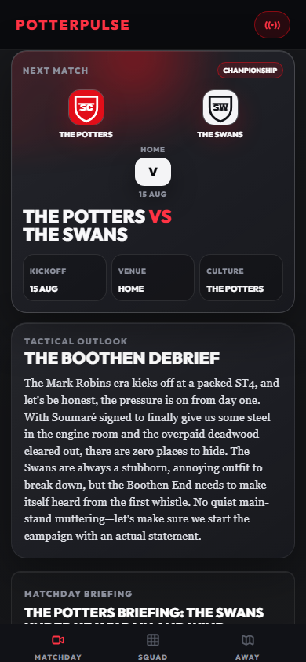
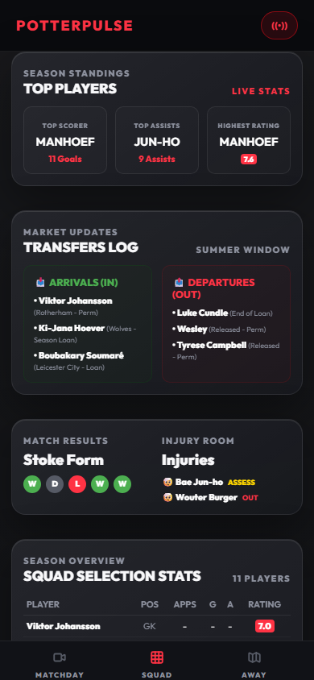
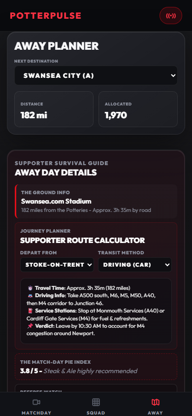

# PotterPulse

PotterPulse is a high-density Stoke City supporter dashboard that combines fixtures, live fan sentiment, player ratings, Terrace Threads, squad visuals, and away-day planning in a single Node/SQLite web app.



> [!NOTE]
> PotterPulse is an independent fan-dashboard portfolio concept. It is not affiliated with, endorsed by, or replacing The Oatcake, Stoke City FC, or any existing supporter forum.

## Highlights

- **Matches:** fixture centre, completed-match stats, player ratings, POTM, live confidence polling, and Terrace Debates.
- **Squad:** isometric Starting XI pitch, player detail overlays, formation controls, and categorized Terrace Threads.
- **Stats:** telemetry-style match views, editorial verdicts, score popovers, and performance metrics.
- **Away:** ground guides, pubs, hotel notes, route planning, and supporter travel tips.

## Screenshots

Fresh mobile captures from the current app build:

| Matchday | Squad | Away Days |
| --- | --- | --- |
|  |  |  |

## Tech Stack

- **Frontend:** semantic HTML, vanilla CSS, vanilla JavaScript
- **Backend:** Node.js HTTP server in `scripts/server.mjs`
- **Database:** SQLite through Node's native `node:sqlite` API
- **Testing:** Playwright layout checks in `scripts/ci-mobile-layout-check.mjs`
- **DevOps:** Dockerfile, GitHub Actions workflow, and ECS/Fargate Terraform stub

## Run Locally

```powershell
npm install
$env:PORT="4179"; node scripts/server.mjs
```

Open [http://localhost:4179](http://localhost:4179).

Direct views:

- [Matches](http://localhost:4179/#matches)
- [Squad](http://localhost:4179/#squad)
- [Away Days](http://localhost:4179/#away-days)

## Verification

```powershell
npm run check
npm run test:layout
```

## Project Notes

- Full engineering diary: [docs/BUILD_HISTORY.md](docs/BUILD_HISTORY.md)
- Fresh screenshot paths: [matchday](assets/screenshots/matchday-mobile.png), [squad](assets/screenshots/squad-mobile.png), [away days](assets/screenshots/away-days-mobile.png)
- SQLite database: `potter_pulse.db`

## Next Steps

- Add a public demo URL.
- Add a demo reset/seed command.
- Move schema changes into explicit migrations.
- Add an accessibility pass for keyboard flow, labels, contrast, and reduced motion.
