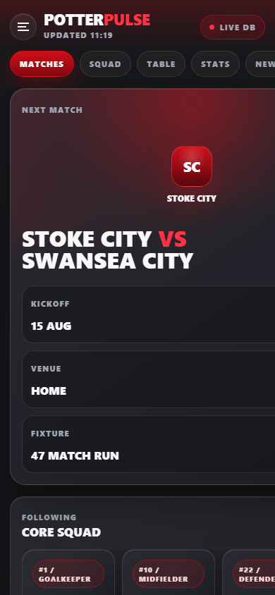

# Potter Pulse



Potter Pulse is a work-in-progress local Stoke City tracker app built around a small SQLite database and a lightweight Node renderer. It presents the squad and fixture run as a premium black-and-red high-density sports data dashboard, drawing on patterns from real-time telemetry interfaces while keeping the look recognisably Stoke-focused. This is not a finished production app yet; it is an actively evolving prototype with real data, a live local renderer, and a documented design direction.

## Project Status

Potter Pulse is currently a work in progress. The core local architecture is working, the SQLite data is populated, and the high-density dashboard direction is established, but the project still needs refinement before it should be treated as production-ready.

Known WIP areas:

- Add richer fixture detail screens and interaction states.
- Improve responsive polish across more viewport sizes.
- Decide whether to keep the current no-build Node renderer or migrate to a fuller frontend stack later.

## Current Architecture

```text
Potterpulse/
|-- .github/
|   |-- workflows/
|       |-- ci-cd.yml                  # GitHub Actions test and container build pipeline
|-- Dockerfile                         # Multi-stage Node runtime container
|-- index.html                         # Single-page dashboard shell and CSS
|-- package.json                       # CI test scripts and Playwright dependency
|-- package-lock.json                  # Locked dependency graph for CI
|-- potter_pulse.db                    # SQLite database used by the renderer
|-- assets/
|   |-- crests/                        # Local SVG crest assets
|-- infra/
|   |-- main.tf                        # ECS/Fargate infrastructure stub
|-- scripts/
|   |-- ci-mobile-layout-check.mjs     # Playwright mobile layout regression check
|   |-- server.mjs                     # Local Node HTTP server and SQLite renderer
|   |-- seed-potter-pulse.mjs          # Initial seed script for core players/fixtures
|-- docs/
|   |-- screenshots/
|       |-- dashboard_latest.png       # Latest README hero screenshot
|-- potterpulse-*.png                  # Local verification screenshots generated during QA
```

## How It Works

The app is intentionally simple:

1. `potter_pulse.db` stores the squad and fixture data.
2. `scripts/server.mjs` opens the SQLite database with Node's built-in `node:sqlite` module.
3. The server reads `index.html` as a template.
4. It injects live database values into placeholders such as `{{heroOpponentDisplay}}`, `{{homeDisplayName}}`, `{{matchdayBriefingHeadline}}`, `{{matchdayBriefingSummary}}`, `{{squadCards}}`, `{{fanPollOptions}}`, and `{{fixtureTimeline}}`.
5. The page is served locally at `http://localhost:4173`.
6. `POST /api/vote` persists fan performance votes into SQLite and returns updated aggregate poll percentages.
7. The active culture profile maps canonical team names to supporter-facing display names without mutating fixture data.

This means there is no framework build step or frontend bundler required for the current version. The app is a fast local prototype with real persisted data.

GitHub Actions now performs the production guardrails that do require tooling: dependency install, Node syntax checks, Playwright mobile layout verification, and Docker image build validation.

## Database

Database file:

```text
potter_pulse.db
```

Tables:

```sql
stoke_squad
```

Purpose: stores tracked Stoke City players.

Important columns:

```text
id
player_name
position
squad_number
nationality
date_of_birth
created_at
updated_at
```

```sql
efl_fixtures
```

Purpose: stores Stoke City fixtures.

Important columns:

```text
id
competition
match_date
opponent
venue
status
stoke_score
opponent_score
created_at
updated_at
```

Dates are stored as clean `YYYY-MM-DD` text so the frontend can format them consistently.


```sql
fan_poll_votes
```

Purpose: persists aggregate fan performance poll votes across runtime restarts and page reloads.

Important columns:

```text
option_key
label
note
vote_count
created_at
updated_at
```

Venues are normalized as lowercase values:

```text
home
away
neutral
```

## Data Currently Seeded

The squad table contains the initial core squad:

```text
Viktor Johansson #1, goalkeeper
Bae Jun-ho #10, midfielder
Junior Tchamadeu #22, defender
Million Manhoef #42, forward
```

The fixture table contains the full 47-match layout supplied during the build, starting with:

```text
2026-08-08 | EFL Cup | Oldham Athletic | home
2026-08-15 | Championship | Swansea City | home
2026-08-22 | Championship | Southampton | away
```

and ending with:

```text
2027-05-01 | Championship | Millwall | away
```

## Running Locally

Start the local server:

```powershell
node scripts\server.mjs
```

Open the app:

```text
http://localhost:4173
```

If another process is already using port `4173`, stop the old Node server or run with another port:

```powershell
$env:PORT = '4174'
node scripts\server.mjs
```


## Current App Views

The UI now has a streamlined three-tab client-side structure. The top pill navigation and bottom navigation both target the same view controller.

Direct local routes:

```text
http://localhost:4173/#matches
http://localhost:4173/#squad
http://localhost:4173/#away-days
```

View responsibilities:

- `Matches`: next-match hero card, Boothen Verdict fanzine block, fan performance poll, and fixture centre.
- `Squad`: tactical pitch squad view with circular player markers.
- `Away Days`: work-in-progress away guide showing ground, travel time, safe pub, pie-index, form, referee, and weather briefing details.

## Design Direction

The original interface looked closer to a traditional admin dashboard: large desktop panels, a broad hero card, and a flat information layout.

The current direction is closer to a high-density match telemetry interface:

- Compact top app bar
- Horizontal pill navigation
- JavaScript-controlled tab views for Matches, Squad, and Away Days
- Premium match-centre card
- Bold uppercase match typography
- Black-and-red Stoke colour system
- Soft crimson glow effects
- Dense fixture rows
- Tactical pitch squad view with circular player markers
- Formation controls for switching between compact tactical layouts
- Independent fanzine editorial card for fan voice inside the Matches flow
- Fan performance voting poll inside the Matches flow
- Away Day guide card for supporter travel notes
- Pre-match briefing tiles for form, officials, and weather
- Bottom navigation designed for fast mobile telemetry scanning

The goal is to build a portfolio-safe interface language around compact hierarchy, live-match modules, pill tabs, dense rows, dark surfaces, high-contrast action areas, and real-time sports telemetry patterns.

## Engineering Struggle Log

### 1. Hand-coded data fatigue vs automated Node REPL bulk data ingestion

At the start, adding fixture data manually would have meant repeatedly writing individual SQL inserts and checking them by hand. That was slow, error-prone, and exactly the kind of work that creates subtle inconsistencies in dates, venues, and competition labels.

The solution was to use the Node REPL MCP with Node's SQLite support to parse the complete pipe-delimited fixture table and insert all 47 rows using clean parameters. The import normalized dates to `YYYY-MM-DD` and venues to lowercase `home` / `away` / `neutral`. That made the data reliable for the CSS frontend and removed the fatigue of hand-coded rows.

### 2. Browser sandbox process breakpoint crash `0x80000003` vs manual browser inspection workaround

During visual verification, browser automation hit environment and sandbox friction. Playwright initially could not find the expected Chromium runtime from the Node REPL environment, and browser launching from the sandboxed MCP runtime was blocked. This class of failure was treated as a browser sandbox/process breakpoint problem, including the kind of local Windows crash/debug behaviour represented by `0x80000003`.

The workaround was practical: run the local Node server directly, open the app manually in the browser, and use Playwright from the terminal where browser process launch permissions were available. Screenshots were captured with `npx playwright screenshot`, then inspected from the generated image. When the image viewer could not read from the temp path, the screenshot was saved into the project and emitted through the Node REPL as an inline image.

That gave us a reliable visual inspection loop without blocking the build on sandbox-specific browser launch behaviour.

### 3. Flat old-school admin styling vs ultra-premium glassmorphic sports design

The first version worked, but it looked like a dark admin dashboard rather than a modern sports product. It had useful panels, but the styling lacked the compact, immersive feel of high-end sports apps.

The redesign moved the interface toward a premium mobile sports app language:

- Radial dark backgrounds instead of flat solid fills
- Translucent cards and layered dark surfaces
- Thin semi-transparent borders
- Deep outer shadows
- Heavy uppercase typography
- Crimson glow behind the match module
- App-style tabs, cards, fixture rows, and bottom navigation

The result keeps Potter Pulse black and red, but gives it more of the energy and density seen in modern match-centre apps.


### 4. Squad-card clipping vs tactical pitch layout

The squad section originally used compact horizontal cards. That solved some height issues, but it still created a familiar mobile problem: long names and position labels could clip, and the row looked like generic app chrome rather than something native to football.

The solution was to turn the squad section into a tactical pitch view. The four tracked players are now rendered as circular markers on a pitch-style canvas. A key implementation issue was that the generated HTML used data attributes such as `data-number="#42"`, while the first selector idea targeted `data-number="42"`. The selectors were corrected to match the rendered markup exactly. We also shortened player names in `scripts/server.mjs` so the marker labels fit cleanly on mobile and desktop.

### 5. Corporate stats card vs independent fanzine voice

The old `Match Pulse` card was useful, but it felt corporate and generic. To give Potter Pulse more local identity, it was replaced with `The Boothen Verdict`, an editorial-style fanzine card inspired by the independent Stoke fan voice.

The first pass needed care because the replacement had to fit beside the tactical pitch on desktop and below it on mobile. The final version uses serif italic body copy, compact metadata, and a strong `100% Free Zine` chip while keeping the block responsive.

### 6. Single dashboard layout vs tabbed app structure

As the interface grew, stacking every module on one dashboard started to make the app feel crowded. The next architecture step was to introduce tab-view wrappers for `Matches`, `Squad`, `Pulse`, and `More`.

A proposed script had the right idea, but one replacement target was written as raw HTML instead of a quoted string, which would have crashed immediately. The implementation was applied safely by locating the existing match card, squad panel, fanzine panel, and fixture centre, then wrapping them into dedicated views. A small JavaScript controller now toggles matching top tabs and bottom navigation buttons using `data-view` and `data-tab-view` attributes.


### 7. Mobile bottom navigation burial vs sticky safe-area navigation

Once the app gained real tab views, the bottom navigation needed to behave like a native mobile app control. The first version sat in normal document flow, which meant long tab content could separate the nav from the viewport bottom or make the user scroll past the main controls.

The fix was added inside the mobile breakpoint: the bottom nav is fixed to the bottom of the viewport with a high z-index, safe-area padding, and an extra `80px` bottom padding on `.content-grid` so content is not hidden behind the navigation bar. This was verified on the mobile Squad view with a Playwright screenshot.

### 8. Static squad pitch vs interactive formation controls

The tactical pitch initially showed one fixed marker layout. That made the squad tab visually stronger, but it did not yet feel like an app tool. The upgrade added compact formation controls above the pitch with `4-3-3 Attack` and `5-3-2 Solid` options.

The main implementation problem was selector drift. The rendered cards use attributes such as `data-number="#42"`, so the JavaScript formation map had to use the same `#42` keys. Once that was aligned, clicking a formation updates the active chip and adjusts the player marker positions without rebuilding the DOM.

### 9. More placeholder vs Away Day travel guide

The More tab was deliberately labelled as work in progress, but an empty placeholder did not add much value. It has now become the first Away Day guide surface, starting with Swansea City data and a second West Brom entry staged in the server lookup for future switching.

The data lives in `scripts/server.mjs` as an `awayGuides` lookup and is rendered through clean template replacements in `index.html`. This keeps text clean for the CSS frontend and avoids hard-coding travel details directly into the markup.

Problems found and solved during this pass:

- A stale local Node server was still serving the old template, so rendered HTML showed unreplaced placeholders. The server was restarted after the template and server changes landed.
- The mobile bottom padding fix had been overwritten later in the same media query by another `.content-grid` rule. The later rule now keeps the `80px` padding so content does not sit under the fixed nav.
- The More tab needed to span the app grid on desktop. The Away Day card now carries `.single-view` so it behaves like the other full-width tab views.
- Playwright reported a console 404 for `favicon.ico`. That is harmless for this feature pass, but a small favicon asset remains a tidy-up item.

### 10. Static Away Day card vs dynamic pre-match briefing

The Away Day guide now has a server-side briefing layer. `scripts/server.mjs` contains a `nextMatchBriefing` lookup with form strings, referee notes, weather, and kit advice. The render pipeline normalizes opponent names into lookup keys and chooses the first upcoming match in the next-five window that has both guide and briefing data, with Swansea as the current work-in-progress fallback.

The original pasted approach could not be applied directly because the app stores fixture dates as `match_date`, not `date`, and there was no existing `upcomingMatches` variable to replace. The implementation was adapted to the real database shape and existing `hero` fallback instead of replacing a non-existent code path.

Problems found and solved during this pass:

- The West Brom fixture name normalizes to `west_bromwich_albion`, while the guide key is `west_brom`. An alias map now keeps those keys connected.
- The weather separator briefly rendered as an encoding placeholder. It was changed to a plain ASCII dash so the CSS frontend gets clean text.
- The guide needed to remain visibly unfinished. The More tab chip now includes `WIP` while still showing the active guide tag.
- The Playwright MCP browser context closed during DOM inspection, so verification fell back to the reliable Playwright CLI screenshot workflow.

### 11. Four-tab spread vs streamlined three-tab architecture

The app had grown into four tabs: Matches, Squad, Pulse, and More. That was useful while experimenting, but it made the product feel split across too many shallow surfaces. The layout has now been consolidated into three tabs: Matches, Squad, and Away Days.

The Boothen Verdict moved out of its standalone Pulse view and into the Matches flow directly under the match hero. A new fan performance voting poll sits below the fanzine card and above the fixture list, so the match-day content now reads as one continuous experience before the schedule.

The old More view has been renamed to `#view-away-days` and wired through `data-view="away-days"` / `data-tab-view="away-days"`. It still uses the dynamic server-side away guide and briefing data, now including travel time and a clearer Safe Pub label.

Problems found and solved during this pass:

- There was no existing fan performance poll in the HTML, so a compact poll component was added instead of leaving that directive implied.
- A broad verification regex counted `tab-view` wrappers as top-level tabs and falsely reported more than three tabs. The check was tightened to count only actual tab buttons, confirming three top tabs and three bottom nav buttons.
- The away guide had mileage but not travel time. `scripts/server.mjs` now includes a dedicated `travelTime` value for each seeded away guide.

### 12. Local prototype vs container-ready runtime, persisted votes, and crest assets

The app now has a deployment-oriented runtime layer. A multi-stage `Dockerfile` checks the Node server syntax in the first stage and runs the app from a non-root `node` user in a lightweight Bookworm-slim runtime stage. The runtime copies only the required app files: `index.html`, `scripts/`, `assets/`, and `potter_pulse.db`. A minimal `infra/main.tf` stub defines the ECS/Fargate task, service, log group, networking inputs, and port `4173` mapping for cloud-native context.

The fan performance vote moved from static HTML into persisted backend state. `scripts/server.mjs` now owns a `fan_poll_votes` table, seeds the known poll options, renders aggregate percentages into `{{fanPollOptions}}`, and exposes `POST /api/vote` so client votes survive page reloads and server restarts.

The match hero no longer depends on text-only crest blocks. Local SVG assets live under `assets/crests/`, are mapped by normalized team keys in the renderer, and are served through a constrained `/assets/...` route. The crest-specific WIP wording was removed from the README because the visible interface now uses local asset paths.

Problems found and solved during this pass:

- The project has no `package.json` or frontend build step, so the container explicitly skips npm/bundler work and validates with `node --check scripts/server.mjs`.
- The original poll was static markup. It is now server-rendered from SQLite and updated through a JSON POST route.
- The first vote verification intentionally changed the local database; the counts were reset to zero after confirming persistence so the committed seed state stays clean.
- Crest placeholders were still using text initials. The hero now renders SVG images via `{{homeCrestSrc}}` and `{{awayCrestSrc}}`.

### 13. Full fixture wall vs default five-match view and culture profiles

The fixture centre now renders all 47 fixtures in the HTML but collapses everything after the first five rows by default. A mobile-safe `Show All` / `Collapse` control toggles the fixture list with a CSS class instead of rebuilding the DOM, so the full schedule remains available without overwhelming the first viewport.

A lightweight backend culture profile map now lives in `scripts/server.mjs`. The default profile is `the_potters`, labelled `The Potters`, and it maps canonical database team names to supporter-facing labels such as `The Potters`, `The Swans`, and `The Baggies`. The SQLite fixture data stays canonical; only the rendered display names change through helper replacements such as `{{homeDisplayName}}`, `{{heroOpponentDisplay}}`, and `{{awayOpponentDisplay}}`.

Problems found and solved during this pass:

- The fixture list needed to keep all 47 rows available for search/inspection while showing only five by default. The renderer marks rows after index five with `.is-collapsed` and the client toggles `.fixture-list.expanded`.
- Hard-coded `Stoke City` and opponent labels in the hero would have bypassed localization. Those labels now use backend display-name mappings.
- Mobile verification confirmed the default view shows five rows, expands to 47 rows, collapses back to five, and keeps the bottom nav fixed.

### 14. Raw referee/weather tiles vs generated matchday briefing analysis

The fixture centre now has a highlighted matchday briefing card generated by `scripts/server.mjs`. The generator reads the active upcoming match context, referee profile, weather condition, forecast temperature, and culture-aware team labels, then outputs a headline and a three-sentence analytical summary for the Fixture Centre.

The current default profile renders a headline like `The Potters briefing: The Swans under heavy rain and wind`. The summary combines surface conditions, temperature, referee discipline risk, and kit advice so the briefing feels like analysis rather than disconnected data tiles.

Problems found and solved during this pass:

- The referee and weather data already existed in `nextMatchBriefing`, but it only appeared as separate Away Days tiles. The new `generateMatchdayBriefing` function turns that structured data into a culture-aware narrative.
- The card needed to sit above the default five-fixture list without breaking the mobile-safe navigation. Mobile verification confirmed the card fits a `390px` viewport, the fixture toggle still expands from five to 47 rows, and the bottom nav remains fixed.
- The only browser console issue remained the known `favicon.ico` 404, unrelated to this briefing pass.

### 15. Local manual QA vs GitHub Actions CI/CD pipeline

The project now has a GitHub Actions workflow at `.github/workflows/ci-cd.yml` that runs on pushes to `main`. The `test` job installs Node 24 dependencies, runs `node --check scripts/server.mjs`, and executes a Playwright mobile viewport regression check. The `build` job only runs after tests pass and validates the existing multi-stage Dockerfile with `docker build --tag potter-pulse:ci .`.

Because the project originally had no package metadata, a minimal `package.json` and `package-lock.json` were added for CI-owned scripts and the Playwright dependency. The layout test lives in `scripts/ci-mobile-layout-check.mjs`; it starts the local server on port `4183`, opens the Matches view at a 390px mobile viewport, verifies the matchday briefing card, confirms the default five-fixture state, expands to all 47 fixtures, collapses back to five, and checks the fixed bottom navigation.

Problems found and solved during this pass:

- The first local Playwright run hit sandbox process restrictions, so the check was rerun from an elevated terminal path while keeping the workflow itself standard for GitHub-hosted runners.
- Port `4173` was already used by the development server, so the CI layout test uses port `4183` by default.
- CSS uppercase rendering made `innerText` unsuitable for checking the culture display name. The test now uses `textContent` for that assertion while still checking visible layout state through computed styles.
- Local `node_modules`, Playwright MCP scratch files, and QA screenshots are ignored so the repository stays focused on source, docs, and reproducible pipeline files.

## Screenshot Workflow

Save the latest dashboard image here:

```text
docs/screenshots/dashboard_latest.png
```

That path is the current README hero image and should be refreshed whenever the app design changes materially.

## Verification Performed

The app has been checked locally with:

```powershell
node --check scripts\server.mjs
```

The rendered page was also checked over `http://localhost:4173` to confirm:

```text
No unreplaced template placeholders
47 fixture rows rendered
4 squad cards rendered
App frame present
Tabbed views present for Matches, Squad, and Away Days
Away Day guide renders without template placeholders
Formation controls switch active state and marker positions
Mobile bottom navigation remains fixed to the viewport bottom
Pre-match briefing renders referee, weather, kit tip, and 10 form pills
Three top tabs and three bottom nav buttons render
Pulse and More standalone views are removed
Boothen Verdict and Performance Vote render before Fixture Centre
Away Days renders travel time, safe pub, and Pie Index metrics
Dockerfile includes check and non-root runtime stages
ECS/Fargate Terraform stub defines port 4173 runtime context
Docker/Terraform CLI validation deferred because those CLIs are not installed locally
Fan poll votes persist in `fan_poll_votes` through `POST /api/vote`
Local SVG crest assets render without text crest placeholders
Fixture Centre shows 5 rows by default and toggles to all 47 rows
Culture profile renders supporter nicknames from canonical team names
Matchday briefing card renders culture-aware headline and referee/weather analysis
GitHub Actions workflow triggers on pushes to main with separate test and Docker build jobs
CI test script validates mobile layout, fixture toggle behaviour, culture text, and fixed bottom navigation
```

Responsive screenshots were generated during visual QA:

```text
potterpulse-mobile.png
potterpulse-mobile-tall.png
potterpulse-desktop.png
potterpulse-view-matches.png
potterpulse-view-squad.png
potterpulse-view-pulse.png (legacy four-tab artifact)
potterpulse-view-more.png (legacy four-tab artifact)
potterpulse-sticky-nav-mobile.png
potterpulse-formation-squad.png
potterpulse-away-guide-mobile.png
potterpulse-away-guide-desktop.png
potterpulse-briefing-mobile.png
potterpulse-briefing-desktop.png
potterpulse-3tab-matches-mobile.png
potterpulse-3tab-away-days-mobile.png
potterpulse-3tab-matches-desktop.png
```


The legacy four-tab pass was verified by rendering direct hash routes with Playwright screenshots before consolidation:

```powershell
npx playwright screenshot --browser chromium --viewport-size=390,844 http://localhost:4173/#matches potterpulse-view-matches.png
npx playwright screenshot --browser chromium --viewport-size=390,844 http://localhost:4173/#squad potterpulse-view-squad.png
npx playwright screenshot --browser chromium --viewport-size=390,844 http://localhost:4173/#pulse potterpulse-view-pulse.png
npx playwright screenshot --browser chromium --viewport-size=390,844 http://localhost:4173/#more potterpulse-view-more.png
```


The Away Day and formation-control pass was verified with:

```powershell
npx playwright screenshot --browser chromium --viewport-size=390,844 http://localhost:4173/#squad potterpulse-formation-squad.png
npx playwright screenshot --browser chromium --viewport-size=390,844 http://localhost:4173/#away-days potterpulse-away-guide-mobile.png
npx playwright screenshot --browser chromium --viewport-size=1280,900 http://localhost:4173/#away-days potterpulse-away-guide-desktop.png
```

Playwright DOM checks confirmed the mobile Away Day panel fits inside a 390px viewport, the bottom navigation is fixed at the bottom, and the `5-3-2 Solid` formation button updates the active control and marker positions.


The pre-match briefing pass was verified with rendered HTML checks and fresh screenshots:

```powershell
npx playwright screenshot --browser chromium --viewport-size=390,844 http://localhost:4173/#away-days potterpulse-briefing-mobile.png
npx playwright screenshot --browser chromium --viewport-size=1280,900 http://localhost:4173/#away-days potterpulse-briefing-desktop.png
```


The three-tab consolidation pass was verified with rendered HTML checks and screenshots:

```powershell
npx playwright screenshot --browser chromium --viewport-size=390,844 http://localhost:4173/#matches potterpulse-3tab-matches-mobile.png
npx playwright screenshot --browser chromium --viewport-size=390,844 http://localhost:4173/#away-days potterpulse-3tab-away-days-mobile.png
npx playwright screenshot --browser chromium --viewport-size=1280,900 http://localhost:4173/#matches potterpulse-3tab-matches-desktop.png
```


The fixture toggle and culture profile pass was verified with rendered HTML checks and a mobile Playwright interaction check:

```text
Default visible fixture rows: 5
Expanded visible fixture rows: 47
Collapsed visible fixture rows: 5
Active culture label: The Potters
Hero opponent display: The Swans
Mobile bottom nav position: fixed
```


The matchday briefing generator pass was verified with rendered HTML checks and a mobile Playwright interaction check:

```text
Briefing headline: The Potters briefing: The Swans under heavy rain and wind
Briefing summary includes: 14 C, heavy rain and wind, Gavin Ward, card-risk analysis, and kit advice
Mobile card width at 390px viewport: 318px
Default visible fixture rows after card insert: 5
Expanded visible fixture rows after card insert: 47
Mobile bottom nav position: fixed
```


The CI/CD pipeline pass was verified locally with:

```powershell
npm install
npm run check
node --check scripts\ci-mobile-layout-check.mjs
npm run test:layout
```

The Docker build step is defined in GitHub Actions and will run on the GitHub-hosted Ubuntu runner after the test job passes.

## GitHub Linking Steps

After `git init` and staging are complete, link this local project to a GitHub repository with these commands.

Replace `YOUR_USERNAME` and `YOUR_REPO_NAME` with your actual GitHub details:

```powershell
git remote add origin https://github.com/YOUR_USERNAME/YOUR_REPO_NAME.git
git branch -M main
git commit -m "Initial Potter Pulse app"
git push -u origin main
```

If the remote already exists, update it instead:

```powershell
git remote set-url origin https://github.com/YOUR_USERNAME/YOUR_REPO_NAME.git
```

To check your configured remote:

```powershell
git remote -v
```

## Next Steps

Good next improvements:

- Move inline CSS into `src` or `styles` if the project grows.
- Add a route for JSON fixture data.
- Add filtering by competition, month, and home/away.
- Add a favicon to remove the browser `favicon.ico` 404 during Playwright checks.
- Keep `docs/screenshots/dashboard_latest.png` refreshed after major UI changes.


